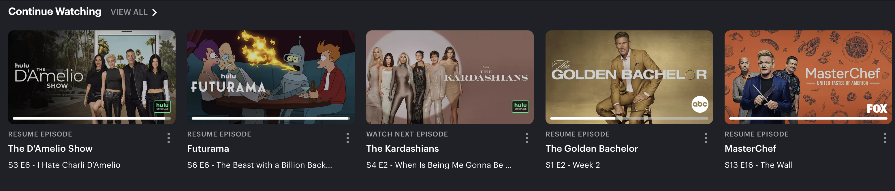

# Hulu: Inconsistant Design and Breaking my Mental Model

I chose to browse Hulu. I want to find a new show to watch, then continue watching a random episode from a show that I have been watching. I think that Hulu’s interface is pretty busy and there is a lot going on. This will prove to be a problem when I am trying to browse the site.

When I first login to the website I am greeted with full screen ads after every 1-3 genre sections. This design is distracting to the user. I want to find something that interests me, and the ads I am served have nothing to do with what I actually want to watch.

The genre filters are in depth, but they are not organized in any meaningful way. I would like to sort by genre if possible. A good way to make this better, would be to add a genre filter. It is not clear how the genre sections are organized.

After scrolling for what felt like an eternity, I found a show that I had heard about but I have not watched yet. I click on the icon for the show, press the plus button and add it to “My Stuff” which is Hulu’s equivalent of the queue system. This is straightforward and works well.

I wanted to find a new show for later, but I wanted to continue watching the show I was currently watching. I scroll up to the top of the screen to try to find the “Continue Watching” slider. This was actually the second slider on screen, the third section on the screen. The giant full screen ad takes up roughly 80% of the start screen.

The most useful feature of Hulu is the “Continue Watching” slider. This is important because Hulu focuses on TV shows rather than movies. TV shows are often long, serialized efforts, and they lead the viewer to come back after every episode.

The interface is cluttered and does not provide a meaningful draw to my eyes for this section. The genre headers are to the left of the screen, and they are in a much smaller font compared to the overall design of the website.

Recently, I have been watching “Dragon Ball Super”, and I want to continue watching it. This is my most recently watched show, yet it is not the first option in the slider. This does not make sense for my mental model of the website.

This does not meet the expectations that I have come to assume from platforms like “Netflix”, “HBO Max”, etc. According to the reading “10 Usability Heuristics for User Interface Design” by Jakob Nielson “Users should not have to wonder whether different words, situations, or actions mean the same thing. Follow platform and industry conventions”. My mental model assumed that the “Continue Watching” slider would be organized according to what I most recently watched. I was confused for a second, and rather than scroll through the slider to find “Dragon Ball Super” I chose to search for it instead. This design is not user friendly, and while it may be interesting to me if I was looking for something to watch that I had given up on, I wanted to watch my most recently watched show.

Overall, I find myself to be using Hulu because it has the shows I want to watch. I do not like using it because the interface is cluttered and does not provide a good browsing experience. My mental model for a streaming service broke several times while browsing the site and even though I have been a long time subscriber, I still do not understand Hulu’s user interface and user experience. 

I would make the interface less cluttered, I would focus on what is important, finding relevant shows, and providing easy access to what I am watching. Full Screen ads that are irrelevant to my viewing patterns do not enhance my user experience, and it is a detriment. I would rework the “Continue Watching” slider to be front and center, and I would organize it by what I most recently watched.

